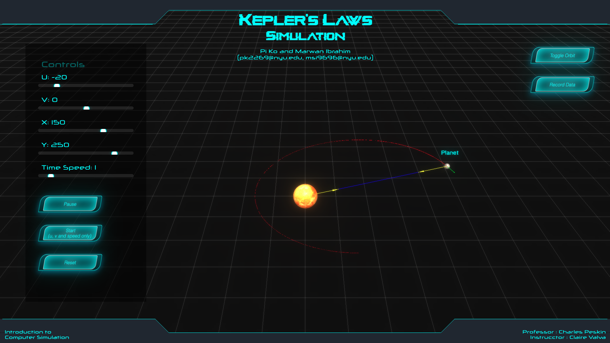

# orbital-simulation
Project Files for Computer Simulation Class Project 1

**Author :** [Pi Ko](https://paingthet.com/) ([pk2269@nyu.edu](mailto:pk2269@nyu.edu))

Marwan Ibrahim([msi9696@nyu.edu](mailto:msi9696@nyu.edu))

The purpose of this project is to create a simulation of a two-body orbital system that consists of a massive star and a planet, using JavaScript programming language. The simulation is designed to prove the validity of the three Kepler's laws of planetary motion. The simulation is based on the lecture notes and materials covered in the class.

The simulation is comprised of a graphical user interface (GUI) that allows users to interact with the system, adjust parameters such as velocity, and position, simulation speed, and observe the system's behavior over a period of time. The simulation is built using a physics engine that calculates the motion of the planet and the star based on numerical methods. The results of the simulation are displayed in real-time using graphical output that depicts the position and velocity of the planet and the star as they move through space.
## Prerequisites

There are no prerequisites. The simulation is deployed on this [website](https://orbital-simulation.vercel.app/) which you can easily access.
